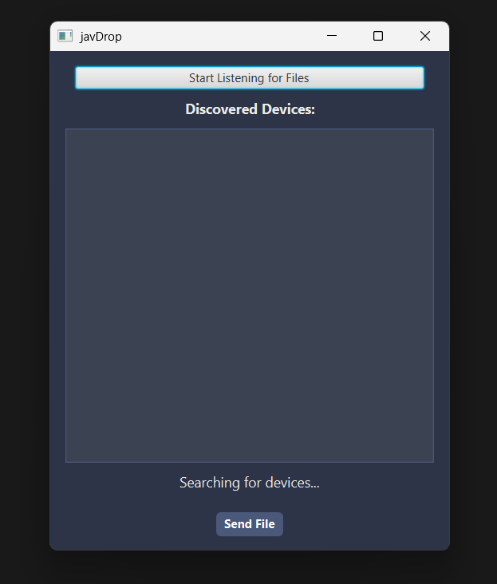
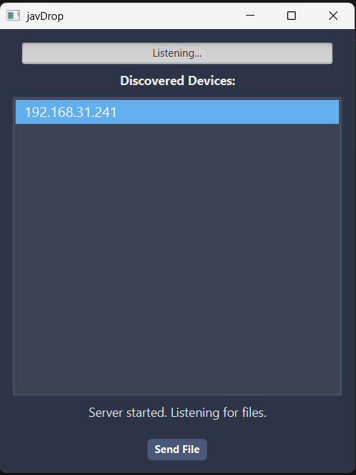
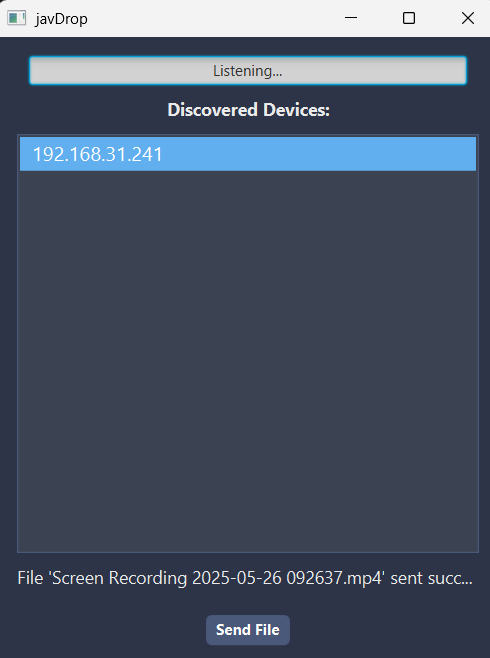

# javDrop 🚀



A cross-platform desktop application built in Java for fast and reliable file transfer over a local area network (LAN). `javDrop` allows users to automatically discover other devices and transfer files securely without needing an internet connection, cloud services, or USB drives.

This application is built from scratch and features a multi-threaded, client-server architecture, a modern JavaFX GUI, and a robust build process using Maven.

---

## 🌟 Features

* **All-in-One Application:** A single, executable JAR file that functions as both a client (sender) and a server (receiver).
* **Automatic Device Discovery:** Uses UDP broadcasting to automatically find other `javDrop` users on the local network.
* **High-Speed File Transfer:** Uses multi-threaded TCP sockets for fast, reliable, and simultaneous file transfers.
* **Modern & Responsive GUI:** A clean, dark-themed user interface built with JavaFX and styled with CSS.
* **Real-time Feedback:** The UI is fully asynchronous, with a live progress bar and status label to provide feedback on transfers without freezing the app.
* **Robust Error Handling:** Gracefully handles common network errors (like connection loss) with user-friendly alert pop-ups.
* **Safe UI State:** All controls (buttons, lists) are correctly disabled during a transfer to prevent conflicting operations.

---

## 📸 Showcase

Here is the application in action.

<p align="center">
  
&nbsp;&nbsp;&nbsp;&nbsp;
  
</p>

---

## 🛠️ Tech Stack

* **Core:** Java (JDK 11)
* **GUI:** JavaFX
* **Build:** Apache Maven (Maven Shade Plugin)
* **Networking:** Java Sockets (TCP/IP & UDP)
* **Threading:** `java.lang.Thread`, `Runnable`, and `Platform.runLater`

## How to Build

This project is built using Maven. To create the final executable "fat JAR":
1.  Clone the repository.
2.  Run the Maven command:
    ```bash
    mvn clean package
    ```
3.  The executable file will be at `/target/javdrop-0.0.1-SNAPSHOT.jar`.

## How to Use

You only need the single executable `.jar` file created in the build step.

1.  **To Run the App:** Double-click the `javdrop-0.0.1-SNAPSHOT.jar` file to launch the GUI.
2.  **To Receive Files:** On the computer that wants to receive files, click the **"Start Listening for Files"** button. The button will toggle to "Listening...".
3.  **To Send Files:** On your computer, the receiving computer's IP address will appear in the "Discovered Devices" list.
    * Select the IP address.
    * Click the **"Send File"** button.
    * Choose a file from the dialog.
    * The file will transfer with live progress updates.